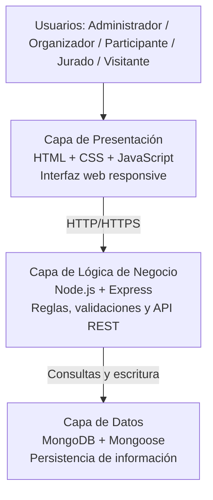

# Arquitectura y Alcance del Sistema CampusFest

## 1. Propósito y Alcance del Sistema

CampusFest es una plataforma web diseñada para apoyar la gestión de festivales estudiantiles universitarios. El sistema permitirá administrar eventos, gestionar participantes, asignar jurados, registrar evaluaciones y publicar resultados de manera centralizada.

## 2. Arquitectura del Sistema

Se utilizará una arquitectura web de tres capas. Esta arquitectura facilita el mantenimiento, la escalabilidad y la seguridad del sistema.

### 2.1 Diagrama de Arquitectura (Capas)

### 2.2 Capa de Presentación

Corresponde a la interfaz gráfica utilizada por los usuarios para interactuar con el sistema desde computadoras, tabletas y dispositivos móviles.

### 2.3 Capa de Lógica de Negocio

Contiene las reglas del sistema relacionadas con:

- Gestión de usuarios.
- Administración de eventos.
- Inscripciones.
- Evaluaciones.
- Publicación de resultados.
- Validaciones de seguridad.

### 2.4 Capa de Datos

Encargada de almacenar toda la información relacionada con:

- Usuarios.
- Eventos.
- Inscripciones.
- Jurados.
- Calificaciones.
- Resultados.

### 2.5 Patrones Arquitectónicos Empleados

| Patrón | Aplicación en CampusFest | Relación con requisitos |
|---|---|---|
| Arquitectura en capas (3-tier) | Separación entre presentación, lógica de negocio y datos para facilitar mantenimiento y evolución del sistema. | RNF-01, RNF-02, RNF-08, RNF-09 |
| Cliente-Servidor | El navegador consume servicios del backend mediante solicitudes HTTP/HTTPS. | RF-08, RF-09, RF-16, RNF-04 |
| API REST | Exposición de recursos (usuarios, eventos, inscripciones, evaluaciones y resultados) mediante endpoints claros y desacoplados del frontend. | RF-06 a RF-17 |
| MVC en backend (evolutivo) | Organización del código en rutas/controladores/modelos para mantener responsabilidades separadas y facilitar pruebas. | RNF-08 y calidad de código |

## 3. Base de Datos

Se utilizará MongoDB como base de datos no relacional para almacenar la información del sistema.

### 3.1 Principales Colecciones

- Usuario
- Rol
- Evento
- Categoría
- Inscripción
- Jurado
- Evaluación
- Resultado

### 3.2 Relaciones Principales

- Un usuario puede tener un rol asignado.
- Un organizador puede crear varios eventos.
- Un participante puede inscribirse en varios eventos.
- Un evento puede tener varios participantes.
- Un evento puede tener varios jurados asignados.
- Un jurado puede registrar múltiples evaluaciones.
- Cada evaluación genera un resultado asociado al participante.

### 3.3 Campos y Tipos de Datos por Colección

| Colección | Campos mínimos (tipo) |
|---|---|
| Usuario | _id (ObjectId), nombreCompleto (String), correo (String), passwordHash (String), rolId (ObjectId), activo (Boolean) |
| Rol | _id (ObjectId), nombre (String), permisos (Array<String>) |
| Evento | _id (ObjectId), nombre (String), descripcion (String), fechaInicio (Date), lugar (String), cupoMaximo (Number), estado (String), organizadorId (ObjectId), requiereEvaluacion (Boolean) |
| Categoría | _id (ObjectId), nombre (String), descripcion (String), activa (Boolean) |
| Inscripción | _id (ObjectId), eventoId (ObjectId), participanteId (ObjectId), estado (String), fechaInscripcion (Date) |
| Jurado | _id (ObjectId), eventoId (ObjectId), usuarioId (ObjectId) |
| Evaluación | _id (ObjectId), eventoId (ObjectId), juradoId (ObjectId), participanteId (ObjectId), criterios (Array<Object>), puntajeTotal (Number) |
| Resultado | _id (ObjectId), eventoId (ObjectId), participanteId (ObjectId), puntajeFinal (Number), posicion (Number), publicado (Boolean) |

## 4. Tecnologías Utilizadas

### 4.1 Frontend

- HTML5
- CSS3
- JavaScript

### 4.2 Backend

- Node.js
- Express.js

### 4.3 Base de Datos

- MongoDB

### 4.4 Control de Versiones

- Git
- GitHub

### 4.5 Gestión del Proyecto

- Jira Software

## 5. API REST (Diseño Inicial)

| Método | Ruta | Descripción |
|---|---|---|
| POST | /api/auth/login | Iniciar sesión con correo y contraseña. |
| POST | /api/auth/forgot-password | Solicitar recuperación de contraseña por correo. |
| POST | /api/usuarios | Registrar cuenta de administrador (alta controlada). |
| GET | /api/usuarios | Listar usuarios para administración. |
| PATCH | /api/usuarios/:id | Editar estado o rol de usuario. |
| POST | /api/eventos | Crear evento (nombre, descripción, fecha, hora, lugar, cupo). |
| PATCH | /api/eventos/:id | Editar evento antes de iniciar. |
| GET | /api/public/eventos | Consultar agenda pública de eventos activos. |
| POST | /api/eventos/:id/inscripciones | Inscribir participante con validación de cupo y no duplicidad. |
| PATCH | /api/inscripciones/:id/cancelar | Cancelar inscripción dentro del plazo permitido. |
| GET | /api/eventos/:id/inscripciones | Consultar inscritos de un evento. |
| POST | /api/eventos/:id/jurados | Asignar jurados a evento. |
| POST | /api/evaluaciones | Registrar calificaciones por criterios. |
| PATCH | /api/eventos/:id/resultados/publicar | Publicar resultados del evento. |
| GET | /api/public/eventos/:id/resultados | Consultar resultados publicados. |

## 6. Alcance del Sistema

El sistema CampusFest incluirá las siguientes funcionalidades:

### 6.1 Gestión de Usuarios

- Registro y autenticación de usuarios.
- Administración de cuentas y roles.

### 6.2 Gestión de Eventos

- Creación y edición de eventos.
- Definición de fecha, hora, lugar y cupos.
- Publicación de eventos activos.

### 6.3 Gestión de Inscripciones

- Inscripción de participantes.
- Control de cupos disponibles.
- Consulta de participantes inscritos.

### 6.4 Gestión de Evaluaciones

- Asignación de jurados.
- Registro de calificaciones.
- Cálculo automático de puntajes.

### 6.5 Gestión de Resultados

- Publicación de resultados.
- Consulta pública de resultados.

## 7. Fuera del Alcance

Las siguientes funcionalidades no formarán parte de esta versión:

- Pagos en línea.
- Aplicación móvil nativa.
- Integración con redes sociales.
- Generación avanzada de reportes estadísticos.